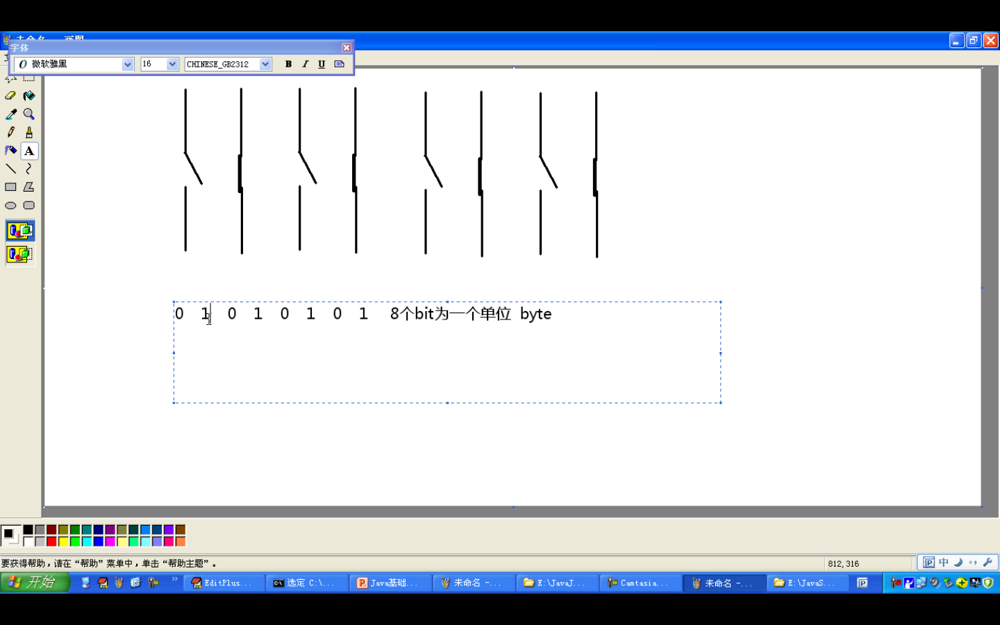
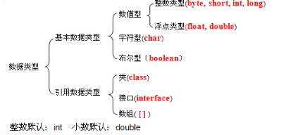

# 2.常量变量及进制


###2.1 常量
* 常量表示不能改变的数值
* 常量的分类：
  1. 整数常量：正数，负数和0；
  2. 小数常量；
  3. 布尔型常量（boolean）,只有两个数值：true,false
  4. 字符常量：字母，数字，符号，字符常量需要用单引号作标识；并且单引号里面只能放一个符号,'1'是字符而'12'就不是字符。
  5. 字符串常量：用双引号作标识符，""也是字符串。
  6. null常量；
  

###2.2 进制
  
* 计算机二进制计数概念


* 整数有四种表现形式:
 1.二进制；
 2.八进制：有特殊的标识就是在前面加0
 3.十进制；
 4.十六进制；有特殊的标识就是在前面加0x，并用了A-F六个字母。

* 进制的转换
 十进制-->二进制 （不断除以2并取余数）
 二进制-->十进制 （乘以2的次幂，四位之内用即8421法）

* 负进制
 1.负数的二进制就是正数的二进制去反+1 ，6---110.
 -6---11111010.负数的二进制最高位都为1；
 2.二进制位都是1，对应的十进制是-1

###2.3 变量
* 变量的概念：
  * 内存中的一个存储区域
  * 该区域有自己的名称（变量名）和类型（数据类型）
  * 该区域的数据可以在同一类型范围内不断变化
* 为什么要定义变量：
  * 用来不断的存放同一类型的常量，并且可以重复使用 
* 注意：
  * 变量的作用范围（一对{}之间有效）
  * 要初始化值
* 定义变量的格式：
  * 数据类型 变量名 = 初始化值；
  * 注：格式是固定的，记住格式
* 变量就如同数学中的未知数
* Java语言是强类型语言，对于每一种数据都定义了明确的数据类型，在内存中分配了不同大小的内存空间。
* 数据类型：


 
```java

class VarDemo
{
    public static void main(String[] agrs)
    {
        //数据类型 变量名 = 初始值
        byte  b = 3;
        short s=4000;
        int x=12;
        long l=12121212l;  //最后要加一个l来标识长整数类型，不然编译会出错
        float f =2.3f; //最后要加一个f来标识float类型
        char ch ='a';  //分号一定要用英文符号
        boolean b1= true;
        
        {
            int z =2:
            System.out.println(z);
        }
        System.out.println(z); //这里的z是打印不出来的因为变量只在一个大括号之内有效
        
        System.out.println("hello")    
    }
}
```


